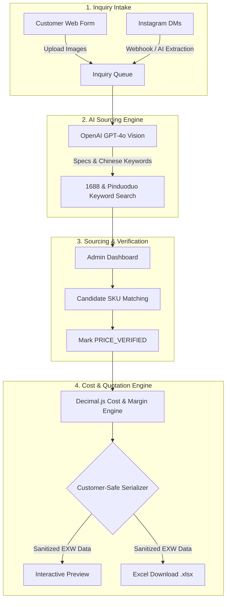

# Sourcing OS

> **Enterprise China Sourcing Management, AI Product Analysis & Customer-Safe EXW Quotation Platform**

Sourcing OS is a modern Next.js 15 web application designed for China sourcing agents, trading companies, and procurement managers. It streamlines the end-to-end sourcing workflow: from omnichannel inquiry intake (web forms & Instagram DMs) and AI multimodal vision analysis to 1688/Pinduoduo supplier candidate matching, precision cost calculations, and customer-facing **EXW China** quotation generation.

---

## 🌟 Key Features

### 📥 1. Omnichannel Inquiry Intake
* **Public Web Portal (`/request`)**: Customer inquiry submission with multi-image file uploads and auto-generated tracking numbers (`ES-YYYYMMDD-XXXX`).
* **Instagram DM Integration**: Asynchronous Meta webhook receiver with intelligent 30–60s debounce windows that extract product requirements from conversations into structured draft inquiries.

### 👁️ 2. Multimodal AI Requirements Analysis
* **Visual & Text Analysis**: Leverages OpenAI GPT-4o multimodal vision models to inspect customer product photos, extract dimensions, materials, and target specs.
* **Supplier Search Keyword Generator**: Automatically generates targeted Chinese search keywords optimized for **1688.com** and **Pinduoduo** platforms.

### 🔍 3. Supplier Candidate Matching & SKU Price Lock
* **Candidate Management**: Track multiple supplier options per inquiry item.
* **Strict Price Verification (`PRICE_VERIFIED`)**: Enforces explicit SKU pricing verification before items can be included in customer quotations, preventing unverified cost estimations.

### 🧮 4. Precision Financial & Margin Calculation Engine
* **Safe Decimal Math**: Powered by `Decimal.js` to guarantee accurate floating-point monetary operations without rounding errors.
* **Configurable Profit Engine**: Applies configurable profit margins, payment terms, and quotation validity windows.

### 📄 5. Customer-Safe EXW Quotation & Excel Export
* **Zero Supplier Data Leakage**: Enforces strict allow-list serialization. Customer-facing quotations automatically sanitize internal cost lines, supplier names, 1688 URLs, and profit margins.
* **Excel (`.xlsx`) Export**: Instant generation of customer-ready EXW China quotation spreadsheets via `ExcelJS`.

### 🛡️ 6. Enterprise Security & Administration
* **Role-Based Access Control (RBAC)**: Supabase Auth integration with strict server-side `OWNER` and `ADMIN` permission enforcement.
* **Fixed-Window Rate Limiter**: Database-backed rate limiting protects public forms and webhook endpoints against abuse.

---

## 🔄 System Architecture & Workflow

---

## 🛠️ Technology Stack

| Category | Technology | Purpose |
| :--- | :--- | :--- |
| **Framework** | Next.js 15 (App Router, TypeScript) | Server Components, Server Actions, Route Handlers |
| **Styling** | Tailwind CSS | Responsive admin dashboard and public forms |
| **Database & Auth** | Supabase (PostgreSQL, Storage, Auth) | Relational data, private file storage, RBAC authentication |
| **AI Integration** | OpenAI API (GPT-4o Vision) | Image spec extraction & Chinese sourcing keyword generation |
| **Monetary Engine** | Decimal.js & Zod | Precision financial calculations & schema validation |
| **Document Export** | ExcelJS | Dynamic Excel quotation workbook generation |
| **Testing** | Vitest | Unit tests for financial math and zero-leakage security checks |

---

## 🔒 Security & Data Privacy Guarantees

* **EXW China Benchmark**: International shipping is strictly separated from product unit pricing to comply with standard trade terms.
* **Allow-List Serialization**: Internal supplier fields (purchase price, markup, 1688 link, supplier phone/address) are stripped at the server boundary before data reaches customer views.
* **Private Storage**: Product uploads are secured using Supabase private buckets and temporary signed URLs for admin review.
* **Server-Only Credentials**: Sensitive API keys (`OPENAI_API_KEY`, `SUPABASE_SERVICE_ROLE_KEY`, `META_APP_SECRET`) are never leaked to client bundles.

---

## 📄 License

This repository contains overview documentation for Sourcing OS. All rights reserved.
